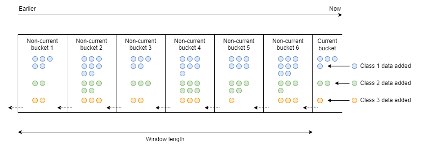
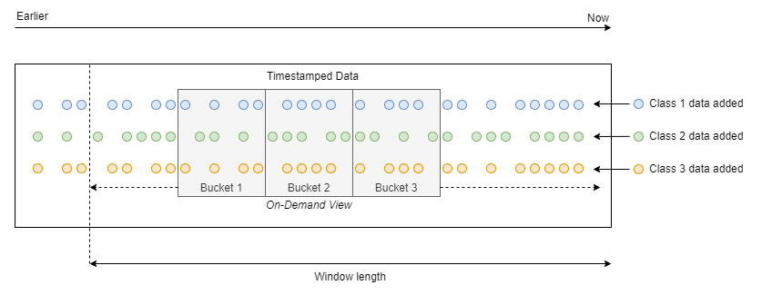

# real-time-sliding-window
[](https://opensource.org/licenses/Apache-2.0)

Real-time sliding window implementations for Kotlin. Supports adding data defined by one or more arbitrary classes and 
offers various methods for data retrieval.  

## Features
- Customizable window settings.
- Supports adding data from multiple arbitrary classes per window.
- Allows adding and retrieving data through various methods, including event-based.
- Fully thread-safe operation.
- Easy integration through [SLF4J](https://github.com/qos-ch/slf4j) for logging and [Micrometer](https://github.com/micrometer-metrics/micrometer)
  for metrics.

## Implementations
Two window implementations are available:

- [Fixed Tumbling Bucketed Window](#fixed-tumbling-bucketed-window)
- [On Demand Bucketed Window](#on-demand-bucketed-window)

Both implementations operate upon a bucketed approach whereby data is grouped into fixed-length time-based buckets,
although entire window data can be acted upon if desired.

| Comparison Point                  | Fixed Tumbling           | On Demand                |
|:----------------------------------|:-------------------------|:-------------------------|
| Window length                     | Configurable             | Configurable             |
| Bucket length                     | Fixed                    | Configurable             |
| Bucket types                      | Tumbling                 | Tumbling<sup>1</sup>     |
| Multiple data class support       | Yes                      | Yes                      |
| Precision                         | Approximate              | Precise                  |
| Availability of added window data | When current bucket ends | Immediately after adding |
| Data retrieval methods            | Arbitrary, event-based   | Arbitrary                |
| Data retrieval cost               | Trivial                  | Non-trivial<sup>2</sup>  |

<sup>1</sup> Support for additional types will be added in the future.<br />
<sup>2</sup> Depending on several factors.

## Fixed Tumbling Bucketed Window
[Usage](docs/fixed-tumbling-bucketed-window.md)



The window comprises a number of fixed-length time _buckets_, which are designated either _current_ or
_non-current_. Data is only added to the _current_ bucket, and the data is timestamped when added. When the current
bucket _ends_, it is then reclassified as _non-current_ and a new current bucket takes its place in front of it.

As each current bucket ends, the window will increase in length until it reaches its configured length. After this
point, the oldest non-current bucket is removed from the window to maintain its configured length.

The window length is the collection of all non-current buckets and does not include the current bucket.

Current buckets (only) allow adding data to the window. Non-current buckets are immutable.

## On Demand Bucketed Window
[Usage](docs/on-demand-bucketed-window.md)



The window comprises a timestamp-ordered collection of data items. Data is appended to the end of collection when
added. Maintenance occurs at regular intervals to remove data items older than the window length.

A tumbling bucketed view of the data in the window is available on demand. The view's start point within the window,
length and bucket length are configurable.

## Getting Started
Add a dependency to your build tool configuration. See [CHANGELOG.md](CHANGELOG.md) for available versions.

### Gradle
```
implementation 'io.github.witomlin:real-time-sliding-window:${realTimeSlidingWindowVersion}'
```

### Gradle (Kotlin DSL)
```
implementation("io.github.witomlin:real-time-sliding-window:${realTimeSlidingWindowVersion}")
```

### Maven
```xml
<dependency>
  <groupId>io.github.witomlin</groupId>
  <artifactId>real-time-sliding-window</artifactId>
  <version>${realTimeSlidingWindowVersion}</version>
</dependency>
```